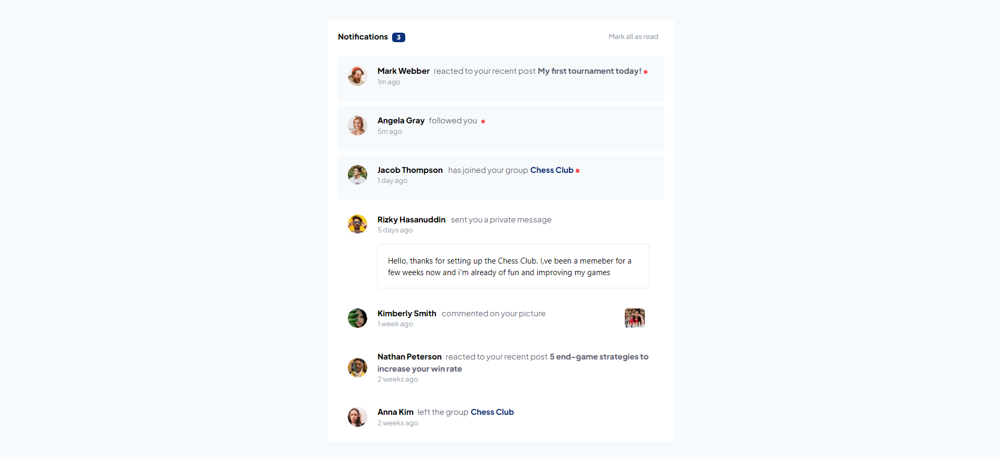

# Frontend Mentor - Notifications page solution

This is a solution to the [Notifications page challenge on Frontend Mentor](https://www.frontendmentor.io/challenges/notifications-page-DqK5QAmKbC). Frontend Mentor challenges help you improve your coding skills by building realistic projects.

## Table of contents

- [Overview](#overview)
  - [The challenge](#the-challenge)
  - [Screenshot](#screenshot)
  - [Links](#links)
- [My process](#my-process)
  - [Built with](#built-with)
  - [What I learned](#what-i-learned)
- [Author](#author)

## Overview

### The challenge

Users should be able to:

- Distinguish between "unread" and "read" notifications
- Select "Mark all as read" to toggle the visual state of the unread notifications and set the number of unread messages to zero
- View the optimal layout for the interface depending on their device's screen size
- See hover and focus states for all interactive elements on the page

### Screenshot

### Links

- Solution URL: [https://github.com/KarimAyman97/notification-page]
- Live Site URL: [https://notification-page-vert.vercel.app/]

## My process

### Built with

- [React](https://reactjs.org/) - JS library
- [Next.js](https://nextjs.org/) - React framework
- [tailwindcss](https://tailwindcss.com/) - A utility-first CSS framework

### What I learned

I learnt how to use Next.js with tailwindcss rather than css, also i learnt how to import local fonts to my project using nextjs14 features.

## Author

- _Github_ - [@karim_Ayman](https://github.com/KarimAyman97)
- _Frontend Mentor_ - [@Karim_Ayman](https://www.frontendmentor.io/profile/KarimAyman97)
- _LinkedIn_ - [@karimAyman](https://www.linkedin.com/in/karimayman97/)
